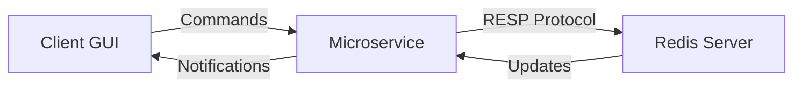

# Taller de Programación - A Todo Rust

Editor de documentos colaborativo implementado en Rust.

## Integrantes

- Camila General  
- Ramiro Mantero  
- Valentina Moreno  
- Franco Secchi  

## Requisitos previos

Para compilar y ejecutar este proyecto, es necesario tener instalado:

- [Rust](https://www.rust-lang.org/tools/install)
- Cargo (incluido con Rust)
- Las siguientes dependencias del sistema para compilar con `Relm4` y `GTK4`:

```bash
sudo apt-get install -y \
    libglib2.0-dev \
    pkg-config \
    libpango1.0-dev \
    libgdk-pixbuf2.0-dev \
    libgtk-4-dev
```

## Arquitectura

El proyecto está estructurado en tres componentes principales que se comunican entre sí:



### Componentes

1. **Cliente (GUI)**
   - Interfaz gráfica usando GTK4
   - Permite edición de documentos
   - Envía comandos al microservicio
   - Recibe actualizaciones en tiempo real

2. **Microservicio**
   - Actúa como intermediario entre clientes y servidor Redis
   - Maneja conexiones de múltiples clientes
   - Traduce comandos del cliente al protocolo RESP
   - Distribuye actualizaciones a los clientes suscritos

3. **Servidor Redis**
   - Almacena los documentos y su contenido
   - Maneja la persistencia de datos
   - Implementa el protocolo RESP
   - Gestiona las suscripciones

## Estructura del Proyecto

```
src/
├── bin/                    # Binarios ejecutables
│   └── run_microservice.rs # Punto de entrada del microservicio
├── lib.rs                  # Biblioteca principal
├── client.rs              # Implementación del cliente
├── microservice.rs        # Lógica del microservicio
├── redis_server.rs        # Servidor Redis
└── commands/              # Comandos y tipos compartidos
    └── client.rs         # Definición de comandos del cliente
```

## Ejecución

Para ejecutar el proyecto completo necesitas iniciar los tres componentes:

1. Servidor Redis:
```bash
make redis
```

2. Microservicio:
```bash
make microservice
```

3. Cliente:
```bash
make client
```

## Como testear
Ejecutando el siguiente comando se correran los tests unitarios
```bash
cargo test
```
